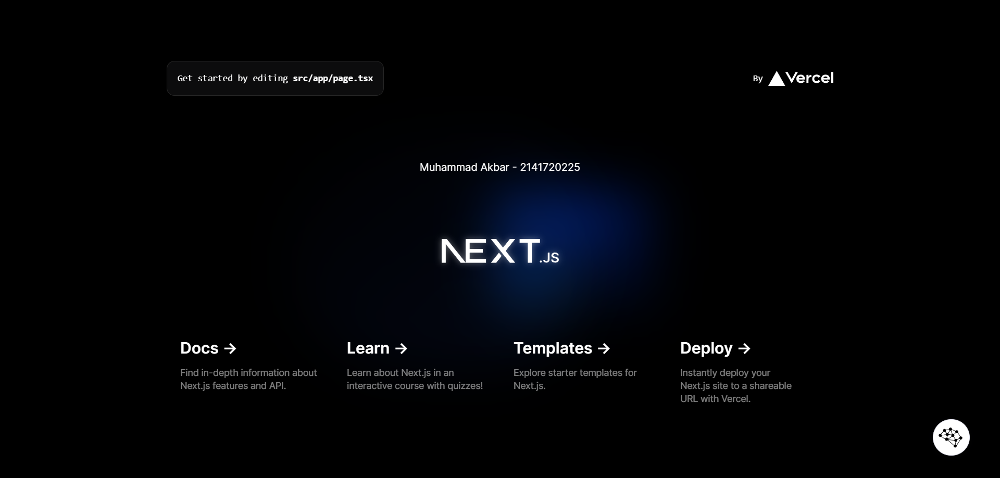

This is a [Next.js](https://nextjs.org/) project bootstrapped with [`create-next-app`](https://github.com/vercel/next.js/tree/canary/packages/create-next-app).

## Getting Started

First, run the development server:

```bash
npm run dev
# or
yarn dev
# or
pnpm dev
# or
bun dev
```

Open [http://localhost:3000](http://localhost:3000) with your browser to see the result.

You can start editing the page by modifying `app/page.tsx`. The page auto-updates as you edit the file.

This project uses [`next/font`](https://nextjs.org/docs/basic-features/font-optimization) to automatically optimize and load Inter, a custom Google Font.

## Learn More

To learn more about Next.js, take a look at the following resources:

- [Next.js Documentation](https://nextjs.org/docs) - learn about Next.js features and API.
- [Learn Next.js](https://nextjs.org/learn) - an interactive Next.js tutorial.

You can check out [the Next.js GitHub repository](https://github.com/vercel/next.js/) - your feedback and contributions are welcome!

## Deploy on Vercel

The easiest way to deploy your Next.js app is to use the [Vercel Platform](https://vercel.com/new?utm_medium=default-template&filter=next.js&utm_source=create-next-app&utm_campaign=create-next-app-readme) from the creators of Next.js.

Check out our [Next.js deployment documentation](https://nextjs.org/docs/deployment) for more details.

|  | Pemrograman Berbasis Framework 2024 |
|--|--|
| NIM |  2141720225|
| Nama |  Muhammad Akbar Nur Ihsan |
| Kelas | TI - 3A |

### Jawaban Soal 1

1. TypeScript adalah superset dari JavaScript yang menambahkan fitur-fitur seperti tipe data statis, kelas, dan modul, membantu kita menulis kode yang lebih terstruktur, mudah dibaca, dan bebas dari bug, serta dapat dikompilasi ke JavaScript untuk digunakan di semua browser dan platform yang mendukung JavaScript.

2. - node_modules => Folder ini berisi semua modul Node.js yang diinstal untuk project. Modul-modul ini dapat digunakan untuk menambahkan fungsionalitas ke aplikasi React
   - public => Folder ini berisi file statis yang akan disajikan langsung oleh server web. File statis adalah file yang tidak perlu diubah oleh server web, seperti gambar, CSS, dan JavaScript.
   - src: Folder ini berisi kode sumber aplikasi React Anda. Kode sumber ini terdiri dari file JavaScript dan file JSX.
   - .eslintrc => file konfigurasi untuk ESLint, sebuah linter statis untuk JavaScript. File ini memungkinkan Anda untuk menentukan aturan khusus yang digunakan ESLint untuk memeriksa kode JavaScript Anda dan melaporkan potensi masalah.
   - 


3. 